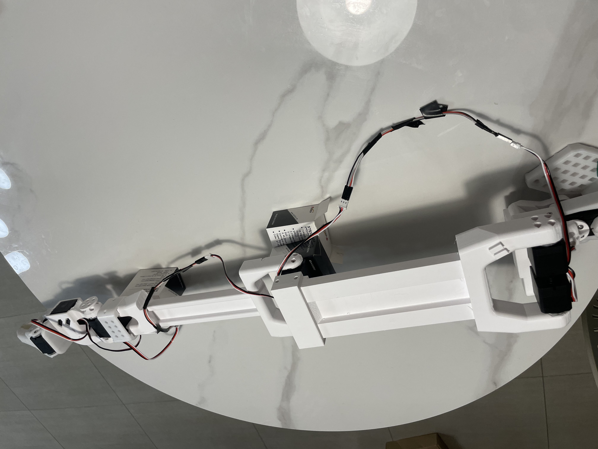
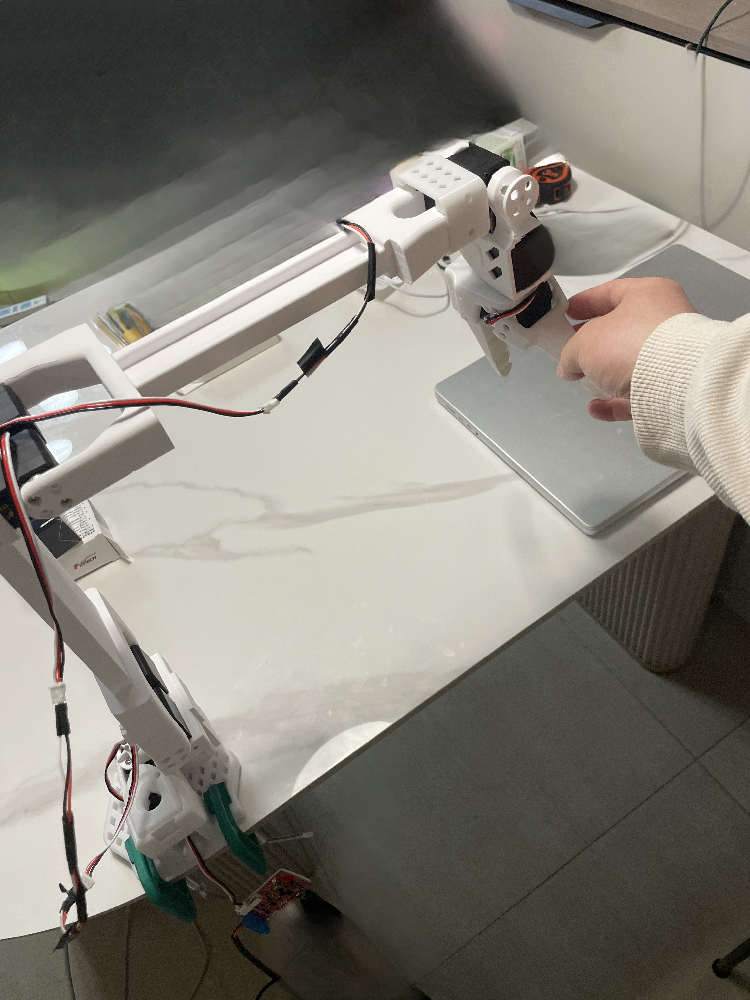
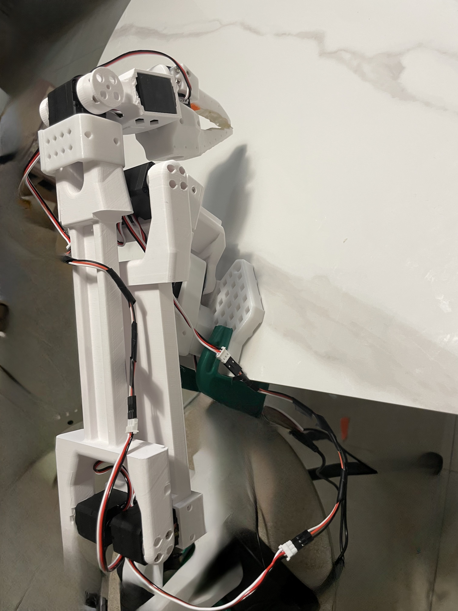

## Introduction
`pingti_lerobot_bridge` enables the use of Lerobot for calibration, teleoperation, data collection, and other tasks on the PingTi Follower Arm and SO-ARM100 Leader Arm.

## 1. (Prerequsite) Install Lerobot
If you have not installed lerobot, pls follow steps below, you can also see [Lerobot Tutorial](pingti/scripts/control_pingti_robot.py) for more in detail explaination
### A. Clone Lerobot
```
git clone https://github.com/huggingface/lerobot.git
```
### B. Create virtual environment
```
conda create -y -n lerobot python=3.10
```
### C. Install Lerobot with feetech sdk
`conda activate lerobot`

`cd ~/lerobot && pip install -e ".[feetech]"`

## 2. Install pingti_lerobot_bridge

### A. Clone repo

`cd` to workspace dir:

```
cd ../
```

Clone repo

```
git clone https://github.com/nomorewzx/pingti_lerobot_bridge.git
```

The directory structure should be like below:

```
your_workspace_dir/
    lerobot/
    pingti_lerobot_bridge/
```

### B. Install pingti_lerobot_bridge

Make sure you are in the python virtual env `lerobot`. Then run command below

```
cd ./pingti_lerobot_bridge && pip install -e .
```

## 3. Calibration

>**Note**: You need to identify the port number of control board of PingTi Arm and control board of SO-ARM100. See [Lerobot tutorial for finding port](https://github.com/huggingface/lerobot/blob/main/examples/10_use_so100.md#c-configure-the-motors)

### A. Update Arm Config

After identifying port number, you should update the config in `./pingti/common/device/configs.py` like below:

```
@RobotConfig.register_subclass("pingti")
@dataclass
class PingTiRobotConfig(ManipulatorRobotConfig):
    calibration_dir: str = ".cache/calibration/pingti"
    leader_arms: dict[str, MotorsBusConfig] = field(
        default_factory=lambda: {
            "main": FeetechMotorsBusConfig(
                port="/dev/tty.usbmodem58A60699971",    <-- Update here
                motors={
                    # name: (index, model)
                    "shoulder_pan": [1, "sts3215"],
                    "shoulder_lift": [2, "sts3215"],
                    "elbow_flex": [3, "sts3215"],
                    "wrist_flex": [4, "sts3215"],
                    "wrist_roll": [5, "sts3215"],
                    "gripper": [6, "sts3215"],
                },
            ),
        }
    )

    follower_arms: dict[str, MotorsBusConfig] = field(
        default_factory=lambda: {
            "main": FeetechMotorGroupsBusConfig( 
                port="/dev/tty.usbserial-1140",      <-- Update here
                motors={
                    # name: (index, model)
                    "shoulder_pan": [(1, "scs_series")],
                    "shoulder_lift": [(2, "scs_series"), (3, "scs_series")],
                    "elbow_flex": [(4, "scs_series"), (5, "scs_series")],
                    "wrist_flex": [(6, "scs_series")],
                    "wrist_roll": [(7, "scs_series")],
                    "gripper": [(8, "scs_series")],
                },
            ),
        }
    )
```

### B. Calibration

Next, you'll need to calibrate your PingTi follower arm and SO-ARM100 leader arm to ensure that the leader and follower arms have the same position values when they are in the same physical position. This calibration is essential because it allows a neural network trained on a PingTi & SO-ARM100 robot to work on another.

#### a. Calibrate PingTi Follower Arm
You will need to move the follower arm to these positions sequentially:

| 1. Zero position | 2. Rotated position | 3. Rest position |
|---|---|---|
|  |  |  |


```
python pingti/scripts/control_pingti_robot.py \
  --robot.type=pingti \
  --robot.cameras='{}' \
  --control.type=calibrate \
  --control.arms='["main_follower"]'
```

#### b. Calibrate SO-ARM100 Leader ARM

| 1. Zero position | 2. Rotated position | 3. Rest position |
|---|---|---|
|  |  |  |

Run this script to launch manual calibration:
```bash
python pingti/scripts/control_pingti_robot.py \
  --robot.type=pingti \
  --robot.cameras='{}' \
  --control.type=calibrate \
  --control.arms='["main_leader"]'
```


## 4. Run teleoperation

Run teleoperation
```bash
python pingti/scripts/control_pingti_robot.py \
  --robot.type=pingti \
  --robot.cameras='{}' \
  --control.type=teleoperate
```

## 5. Record dataset, Training policy etc.

You can follow [Lerobot Tutorial](https://github.com/huggingface/lerobot/blob/main/examples/10_use_so100.md#g-record-a-dataset) for below tasks:

- Record dataset
- Visualize a dataset
- Replay an episode
- Train a policy
- Evaluate your policy

You just need to replace the script `lerobot/scripts/control_robot.py` with `pingti/scripts/control_pingti_robot.py`