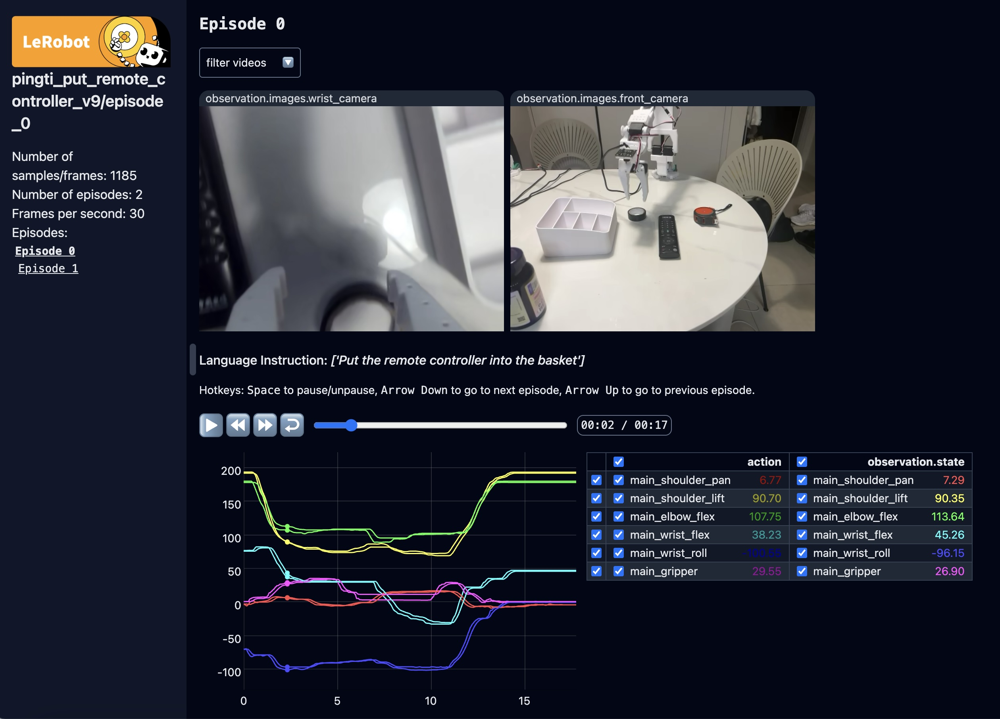

# Data Collection & Visualization Guide for LeRobot

This guide covers common scenarios and solutions when collecting data using LeRobot's recording functionality.

## Basic Recording Controls

If you want to use the Hugging Face hub features for uploading your dataset and you haven't previously done it, make sure you've logged in using a write-access token, which can be generated from the [Hugging Face settings](https://huggingface.co/settings/tokens):
```bash
huggingface-cli login --token ${HUGGINGFACE_TOKEN} --add-to-git-credential
```

Store your Hugging Face repository name in a variable to run these commands:
```bash
HF_USER=$(huggingface-cli whoami | head -n 1)
echo $HF_USER
```

Run command below for recording:

```bash
python -m pingti.record \
    --robot.type=pingti_follower \
    --robot.port=/dev/tty.usbserial-A50285BI \
    --robot.id=my_pingti_follower \
    --robot.cameras="{ front: {type: opencv, index_or_path: 1, width: 1920, height: 1080, fps: 30}}" \
    --teleop.type=so100_leader \
    --teleop.port=/dev/tty.usbmodem58A60699971 \
    --teleop.id=blue \
    --display_data=true \
    --dataset.repo_id=${HF_USER}/record-pingti-new-lerobot-test \
    --dataset.num_episodes=2 \
    --dataset.single_task="Grab lego block"
```

### Keyboard Shortcuts
- `→` (Right Arrow): End current episode early and proceed to environment reset
- `←` (Left Arrow): End current episode and re-record it
- `ESC`: Stop the entire recording process
- `CTRL+C`: Emergency stop (not recommended for normal use)

### Episode Duration
- Set by `--control.episode_time_s` parameter
- Can be shorter if ended early with `→` key
- Actual duration is properly saved in the dataset

## Common Scenarios and Solutions

### 1. Quality Control During Recording

#### Scenario: Current Episode is Not Good
Press `←` to immediately stop and restart the episode

#### Scenario: Need to Take a Break
- Press `ESC` to stop recording
- Use `--control.resume=true` when continuing later

### 2. Managing Recorded Episodes

#### Resuming Recording
To continue recording where you left off:

```bash
python lerobot/scripts/control_robot.py \
    --robot.type=so100 \
    --control.type=record \
    --control.fps=30 \
    --control.repo_id=${HF_USER}/dataset_name \
    --control.resume=true \
    [other original parameters]
 ```

### 3. Best Practices Before Starting
- Plan your total number of episodes ( --control.num_episodes )
- Set appropriate episode duration ( --control.episode_time_s )
- Consider setting longer duration and using → to end episodes early During Recording
- Monitor recording quality in real-time
- Use ← for immediate re-recording if needed
- Take breaks between episodes during reset phase After Recording

## Replay an episode

Run command below for replaying episode

```bash
python -m pingti.replay \
    --robot.type=pingti_follower \
    --robot.port=/dev/tty.usbserial-A50285BI \
    --robot.id=my_pingti_follower \
    --dataset.repo_id=${HF_USER}/record-pingti-new-lerobot-test \
    --dataset.episode=0
```

## Visualization

Visualize the repository using the following command (`cd` to `lerobot` dir before running below command):
```
python lerobot/scripts/visualize_dataset_html.py \
    --repo-id $USER/dataset_name
```
Go to below link to visualize the dataset

http://localhost:9090

You will see something like below:

